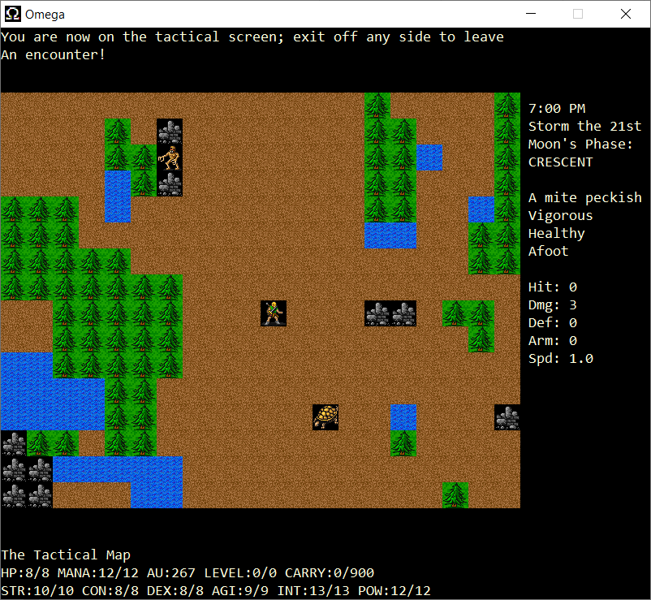

# Omega

Omega is a game written by Laurence Brothers in the late 1980s for Unix workstations. It derives principally from the tradition of earlier games such as Rogue and Hack, where the player explores a labyrinth of dungeons and monsters through the medium of an ASCII map display.

Omega is interesting as it was one of the first such games to show the influence of more story and quest led games, particularly the Ultima series that were released commercially by Origin Systems for various micros during the 1980s. Rather than simply wandering round a dungeon, in Omega the player has various paths open to them to appease the gods of Omega's world.

I've taken Omega 0.80.2 and built it as a "proper" Windows application (rather than the console mode builds that have been available before). This version can also optionally show the area around the player using graphics, rather than the usual ASCII characters. The graphics come from David Gervais' tiles, drawn originally for the game Angband.



## Building

Download and install Visual Studio 2019 Community edition from https://visualstudio.microsoft.com/. In the installer, under "Workloads", make sure that "Desktop development with C++" is selected.

Install git. I use the version of git that is part of Cygwin, a Linux-like environment for Windows, but Git for Windows can be used from a Windows command prompt.

Open the environment that you are using git from (e.g. Cygwin), and switch to the root directory that the build environment will be created under. Clone this repository with git:
```
git clone https://github.com/DavidKinder/Omega.git
```
Start Visual Studio, open the solution "Omega.sln", then build and run the "Omega" project.
